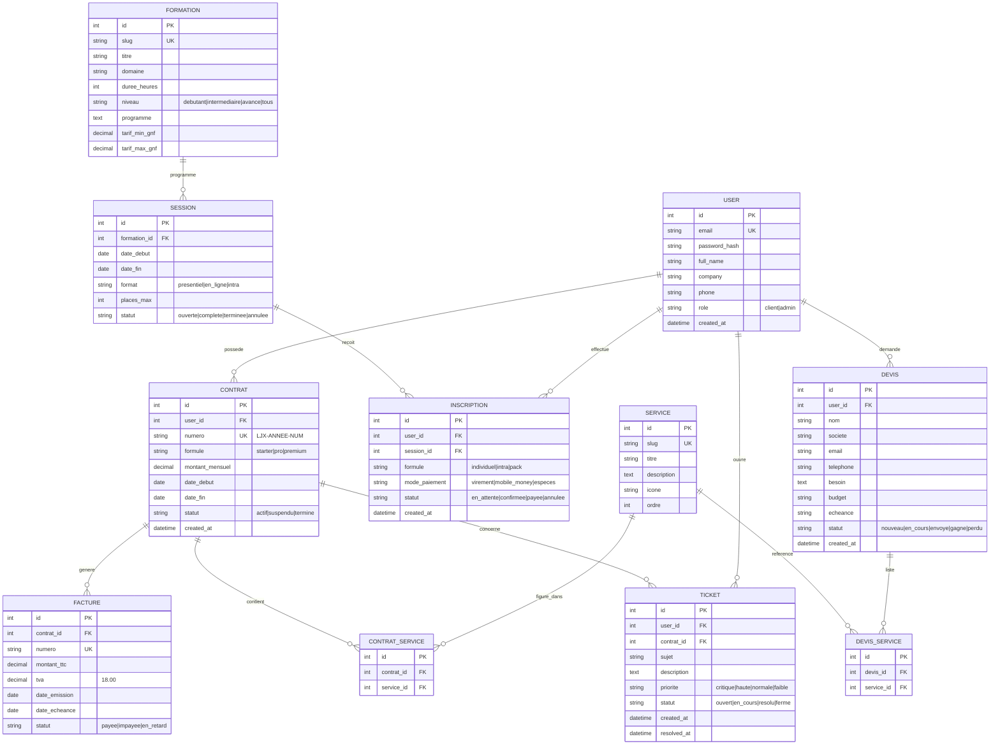

# 03 — MCD (Modèle Conceptuel de Données)

**Backend :** Django + PostgreSQL. Le MCD ci-dessous se traduit en modèles Django (`models.py`).

---

## 1. Diagramme entité-association

## 2. Description des entités

| Entité | Rôle |
|--------|------|
| **USER** | Utilisateurs : clients et admins (champ `role`). Extension du `AbstractUser` Django. |
| **SERVICE** | Les 7 piliers de service (référentiel éditable en admin). |
| **DEVIS** | Demandes de devis issues du formulaire multi-étapes. |
| **DEVIS_SERVICE** | Table d'association devis ↔ services demandés (N-N). |
| **CONTRAT** | Contrat de prestation signé (numéro `LJX-ANNÉE-NUM`). |
| **CONTRAT_SERVICE** | Services couverts par un contrat (N-N). |
| **FACTURE** | Factures rattachées à un contrat (TVA 18 %). |
| **TICKET** | Tickets de support avec priorité et SLA. |
| **FORMATION** | Catalogue du Centre de Formation. |
| **SESSION** | Sessions programmées d'une formation. |
| **INSCRIPTION** | Inscription d'un utilisateur à une session. |

## 3. Règles de gestion

- Un **DEVIS** peut exister sans `user_id` (prospect non inscrit) → `user_id` nullable.
- Un **CONTRAT** appartient à un seul USER mais couvre plusieurs SERVICES.
- La **FACTURE** calcule `montant_ttc = montant_ht * 1.18` (TVA 18 %).
- Le **TICKET** hérite des délais SLA selon `priorite` (Critique 1h/4h, Haute 2h/8h, Normale 4h/24h, Faible 8h/5j).
- Une **SESSION** passe à `complete` quand `inscriptions confirmées == places_max`.
- Les tarifs formation sont en **GNF** (pas de centimes — `DecimalField` max_digits adapté).

## 4. Indices recommandés

- `USER.email` (unique, index).
- `DEVIS.statut`, `CONTRAT.statut`, `TICKET.statut` (filtrage admin fréquent).
- `SESSION.date_debut` (tri catalogue).
- `FACTURE.statut` + `date_echeance` (relances impayés).
